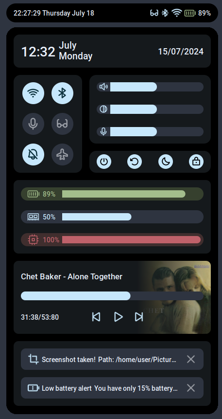

# Usage
Simply clone the repo inside your AwesomeWM configuration path, then use the project as a widget in your `rc.lua` like this:
```lua
screen = 1
awbar = require("awbar")
panel_widget = awbar {
   theme = "nord_m",
   screen = screen
}
```
Now, you can use it as a widget in your AwesomeWM bar:
```lua
my_bar:setup {
  -- other widgets ...
  panel_widget,
  -- other widgets ...
}
```
# Current state: In progress...
